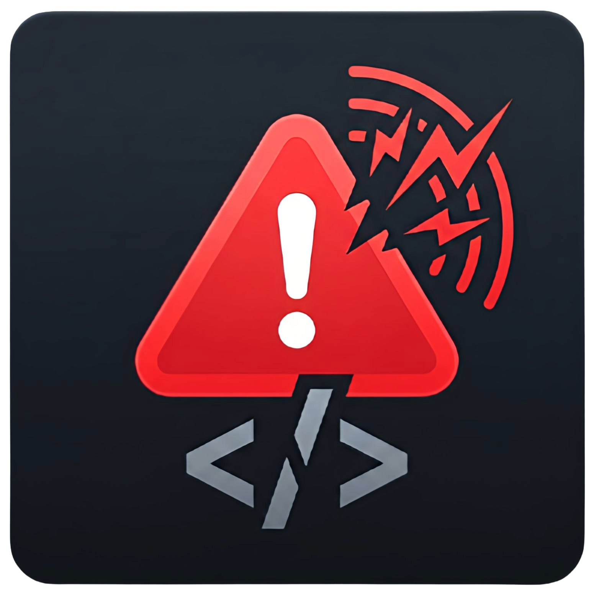

  

# Error Oofies

Plays a random sound when the editor reports an error (diagnostics or terminal).

## FAQ

**Q: Do I need this extension**

**A:** Yes, you do. stop asking these silly questions.

**Install:** marketplace, or build yourself: `npm install && npm run pack`, then Extensions -> ⋯ -> "Install from VSIX...", and just select the VSIX file. 

**Dev:** `npm install`, F5. Settings: `Ctrl+,` -> search "Error Oofies". Test: `Ctrl+Shift+P` -> "Error Oofies: Play test sound". Linux needs `ffplay` or `mpv`.

## Settings

| Setting | Default | Description |
| --- | --- | --- |
| `errorOofies.enabled` | `true` | Enable/disable error sounds |
| `errorOofies.volume` | `0.8` | Volume (0.0–1.0) |
| `errorOofies.soundPack` | `"pain"` | Pack: pain, sexy, halo, meme |
| `errorOofies.cooldownMs` | `10` | Min ms between plays |

---

Based on [spank](https://github.com/taigrr/spank) by [Taigrr](https://github.com/taigrr).
